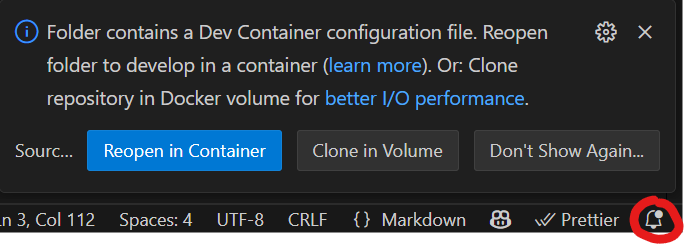

# Zephyr devcontainer VSCode workspace

This repo has (almost) everything you need to get started experimenting with Zephyr contained within a docker container.

You might want to add toolchains by adding them to the [.devcontainer/toolchains.west.yml](.devcontainer/toolchains.west.yml). To get an idea of what to put here, have a look at the [zephyrs .west manifest file](https://github.com/zephyrproject-rtos/zephyr/blob/main/west.yml).

It will take some time to reopen the dev container for the first time or after you changed anything in the Dockerfile or the toolchains.

## Starting the devcontainer

The repo is set up in such a way that if you open the checked out folder with VSCode you should get a prompt to "Reopen in devcontainer". If you missed the pop-up, you should be able to click the little bell in the lower right corner of VSCode.



You can also reopen the container via the command pallette, ctrl + shift + p, and search for "Dev Containers: Reopen in Container".

To exit from the devcontainer back to the host environment, search in the command pallete for "Dev Containers: Reopen Folder Locally".

## File locations

The folder "workspace" in the top of this repo will be mounted to the container on the path /workspace

When the dev container has started, vs code will hopefully open a VSCode-workspace that has been prepared such that you will see four top-level "folders" in you workspace browser. These are mapped to the containers filesystem:


| Workspace entry | Path                  | Description                                                                                                                 |
| --------------- | --------------------- | --------------------------------------------------------------------------------------------------------------------------- |
| workspace       | /workspace            | The workspace folder mounted from the host system                                                                           |
| zephyr          | /opt/zephyr-workspace | The main zephyr-workspace managed by west                                                                                   |
| sdk             | /opt/zephyr-sdk       | The SDKs downloaded by west                                                                                                 |
| build           | /opt/build            | A folder on the containers file system used as building directory before copying the artifacts back to the workspace folder |

## Building your project and getting the artifacts

All of the following instructions assume you are inside the dev container.

There is a helper script that will take care of copying your source to the container-local file-system /opt/build where the build will go faster than if performed in the bind-mounted workspace folder. At least for me on windows.

The script expects a file containing the build commands provided as an argument. For example:

```bash
# nucleo_f446re-build.sh
west build -p always -b nucleo_f446re/stm32f446xx
```

And then you can invoke this with the helper script:

```bash
build nucleo_f446re-build.sh
```

If the build succeeds the artifacts will be placed in the current folder/bin/ if they have any of the file endings listed in the helper scripts list artifact_endings (currently: "bin" "elf" "uf2" "map" "hex").

### Configuring with Menuconfig

The helper scripts recognizes changes to the .config file, that is if you have changed the default settings with for example menuconfig.

To invoke menuconfig, just make a build command and save it to a file, just like when invoking the build:

```bash
# nucleo_f446re-config.sh
west build -p always -b nucleo_f446re/stm32f446xx -t menuconfig
```

And then invoke it with

```bash
build nucleo_f446re-config.sh
```

After saving the config, something along the following lines will be printed to the console:

```bash
Copying artifacts back to work directory/bin..
zephyr.bin not present, skipping
zephyr.elf not present, skipping
zephyr.uf2 not present, skipping
zephyr.map not present, skipping
zephyr.hex not present, skipping
Changed config detected. Diffing and saving diff
root@4ca479f4fb14:/workspace/zephyr-app-1#
```

And the diff will be saved in a convenient format to `./bin/kconfig.diff`.

It might behave a bit weirdly sometimes. It doesn't know what config options are not directly user-configurable. So you might have to filter it a bit manually before adding it to your .conf file. If you rather want to make the diff yourself, all the build files are located in the build folder (/opt/build/ in the container file system).

### Changing the helper script

If you want to alter the build helper script, to for example if your build artifact was of a different kind, alter the [build.sh](.devcontainer\build.sh) (not in the dev container, but this repo) and rebuild the dev container.
